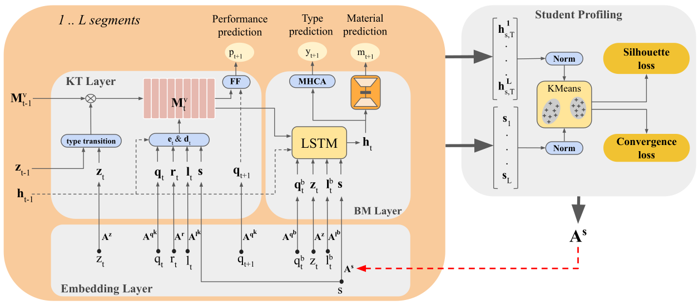

# Personalized Student Knowledge Modeling for Future Learning Resource Prediction (KMaP)

Code for our paper:

S. Hashemifar and S. Sahebi. Personalized Student Knowledge Modeling for Future Learning Resource Prediction. In 26th International Conference on Artificial Intelligence in Education, Palermo, Italy, July 22–26, 2025 (AIED ’25).


## KMaP Network Architecture:




## Prerequisit
```angular2html
numpy
torch
scipy
sklearn
pickle
more_itertools
easydict
matplotlib
```

### How to install and run

```angular2html
git clone https://github.com/persai-lab/2025-AIED-KMaP.git
cd 2025-AIED-KMaP
pip install -r requirements.txt
python run.py
```


## Cite:

Please cite our paper if you use this code in your own work:

```

```

## Collarators:
```angular2html
Soroush Hashemifar: shashemifar@albany.edu or hashemifar.soroush@gmail.com
Sherry Sahebi: ssahebi@albany.edu
```

## Acknowledgement:

This paper is based on work partially supported by the National Science Foundation under Grant Number
2047500.